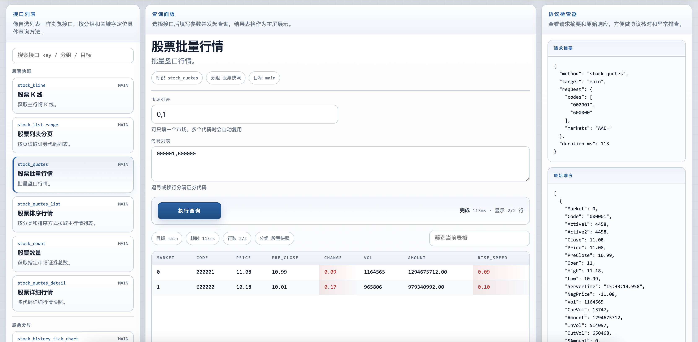

# gotdx
通达信股票行情API golang版


## API
- Connect 连接券商行情服务器
- Disconnect 断开服务器
- GetSecurityCount 获取指定市场内的证券数目
- GetSecurityQuotes 获取盘口五档报价
- GetQuotesDetail 获取详细行情报价
- GetSecurityList 获取市场内指定范围内的所有证券代码
- GetSecurityListRange 获取市场内指定范围内的证券代码
- GetKLine 获取K线
- GetSecurityBars 获取股票K线
- GetIndexBars 获取指数K线
- GetIndexMomentum 获取指数动量
- GetIndexInfo 获取指数概况
- GetMinuteTimeData 获取分时图数据
- GetTickChart 获取当日分时图数据
- GetHistoryMinuteTimeData 获取历史分时图数据
- GetHistoryTickChart 获取历史分时图数据
- GetChartSampling 获取抽样图数据
- GetAuction 获取集合竞价
- GetTopBoard 获取排行榜
- GetUnusual 获取主力监控
- GetTransactionData 获取分时成交
- GetHistoryOrders 获取历史委托
- GetHistoryTransactionData 获取历史分时成交
- GetCompanyCategories 获取公司信息分类
- GetCompanyContent 获取公司信息内容
- GetFinanceInfo 获取财务信息
- GetXDXRInfo 获取除权除息信息
- GetCompanyInfo 获取公司信息聚合结果
- GetFileMeta 获取文件元信息
- DownloadFile 下载文件片段
- DownloadFullFile 下载完整文件
- GetBlockFile 获取完整板块文件
- GetTableFile 获取表格文件
- GetCSVFile 获取 CSV 文件
- ConnectEx 连接扩展市场服务器
- GetExServerInfo 获取扩展市场服务信息
- ExGetCount 获取扩展市场标的数量
- ExGetCategoryList 获取扩展市场分类列表
- ExGetList 获取扩展市场标的列表
- ExGetQuotesList 获取扩展市场行情列表
- ExGetQuote 获取单个扩展市场行情
- ExGetQuotes 获取批量扩展市场行情
- ExGetQuotes2 获取批量扩展市场行情兼容接口
- ExGetKLine 获取扩展市场 K 线
- ExGetHistoryTransaction 获取扩展市场历史成交
- ExGetTickChart 获取扩展市场当日分时图
- ExGetHistoryTickChart 获取扩展市场历史分时图
- ExGetChartSampling 获取扩展市场抽样图
- ExGetBoardList 获取扩展市场板块榜单
- ExGetFileMeta 获取扩展市场文件元信息
- ExDownloadFile 下载扩展市场文件片段
- ExDownloadFullFile 下载完整扩展市场文件
- ExGetTable 获取扩展市场表格
- ExGetTableDetail 获取扩展市场详细表格
- GetParsedBlockFile 获取解析后的板块文件
- GetGroupedBlockFile 获取分组板块文件
- ExQuotes2 统一 Client 扩展市场批量行情兼容入口
- ExBoardList 统一 Client 扩展市场板块榜单入口
- Stock* / Ex* 统一 Client 高阶入口


## Example
```go
package main

import (
	"github.com/bensema/gotdx"
	"log"
)

func main() {
	client := gotdx.New(
		gotdx.WithTCPAddress("124.71.187.122:7709"),
		gotdx.WithExTCPAddress("112.74.214.43:7727"),
	)
	defer client.Disconnect()

	reply, err := client.StockQuotesDetail([]uint8{gotdx.MarketSZ, gotdx.MarketSH}, []string{"000001", "600008"})
	if err != nil {
		log.Fatalln(err)
	}

	for _, obj := range reply {
		log.Printf("%+v", obj)
	}

	exQuotes, err := client.ExQuotes([]uint8{gotdx.ExCategoryUSStock}, []string{"TSLA"})
	if err != nil {
		log.Fatal(err)
	}
	log.Printf("ex: %+v", exQuotes[0])
}
```

更多可直接运行的示例目录：
- `examples/stock_count` 市场证券数量
- `examples/stock_list` 股票列表
- `examples/stock_paged_list` 股票列表分页遍历
- `examples/stock_batch_quotes` 批量快照行情
- `examples/stock_quotes` 主行情报价
- `examples/stock_lowlevel_quote` 直连主行情低层报价接口
- `examples/stock_quotes_list` 排序行情
- `examples/stock_kline` K 线
- `examples/stock_index_tools` 指数和抽样图接口
- `examples/stock_tick` 分时
- `examples/stock_history` 历史分时和历史成交
- `examples/stock_market_watch` 集合竞价、异动、成交分布
- `examples/stock_transaction` 当日逐笔成交
- `examples/stock_f10_block` F10 和板块文件
- `examples/stock_company_raw` 公司/F10 原始接口
- `examples/stock_block_raw` 板块文件原始接口
- `examples/ex_count` 扩展市场数量
- `examples/ex_quote` 单个扩展市场报价
- `examples/ex_list` 扩展市场列表
- `examples/ex_paged_list` 扩展市场列表分页遍历
- `examples/ex_quotes` 扩展市场报价
- `examples/ex_quotes2` 扩展市场批量行情兼容接口
- `examples/ex_quotes_list` 扩展市场排序行情
- `examples/ex_kline` 扩展市场 K 线
- `examples/ex_history` 扩展市场历史成交
- `examples/ex_tick` 扩展市场分时
- `examples/ex_server_info` 扩展市场连接和服务信息
- `examples/ex_sampling` 扩展市场抽样图
- `examples/ex_category_list` 扩展市场分类列表
- `examples/ex_table` 扩展市场表格
- `examples/ex_table_detail` 扩展市场详细表格
- `examples/unified_watchlist` 统一 Client 组合监控示例


## Test
```bash
 go test
```

集成测试默认跳过，如需连接真实主站：

```bash
GOTDX_INTEGRATION=1 go test ./...
```

## Web Viewer
内置了一个轻量 web 查看器，可直接浏览 method、填写参数并以表格查看查询结果。

界面截图：



运行：

```bash
go run ./cmd/webviewer
```

默认地址：

```bash
http://127.0.0.1:8080
```
